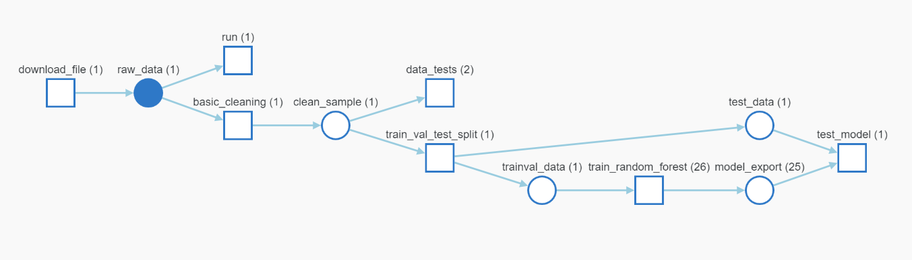

# An ML Pipeline for Short-Term Rental Prices in NYC 
This repo forks a Udacity ML pipeline repo to build a repeatable ML pipeline for predicting 
rental prices for airbnb in NYC. The focus for the project is MLops and infrastructure-as-code
and it leverages the following MLops/DevOps tools:
- [Weight and Biases](https://wandb.ai/) for experiment and artifact tracking
- [MLflow](https://mlflow.org/) for environment separation and orchestration
- [Hydra](https://hydra.cc/docs/intro/) for top-level configuration and command-line flexibility

## Table of contents

- [Preliminary steps](#preliminary-steps)
  * [Create environment](#create-environment)
  * [Get API key for Weights and Biases](#get-api-key-for-weights-and-biases)
  * [Cookie cutter](#cookie-cutter)
  * [The configuration](#the-configuration)
- [Running the pipeline](#running-the-pipeline)
  * [Running the entire pipeline or just a selection of steps](#Running-the-entire-pipeline-or-just-a-selection-of-steps)
  * [Pre-existing components](#pre-existing-components)
- [Adding to the pipeline](#adding-to-the-pipeline)
- [In case of errors](#in-case-of-errors)

## Preliminary steps

### Create environment
Make sure to have conda installed and ready, then create a new environment using the ``environment.yml``
file provided in the root of the repository and activate it:

```bash
> conda env create -f environment.yml
> conda activate nyc_airbnb_dev
```

### Get API key for Weights and Biases
Let's make sure we are logged in to Weights & Biases. Get your API key from W&B by going to 
[https://wandb.ai/authorize](https://wandb.ai/authorize) and click on the + icon (copy to clipboard), 
then paste your key into this command:

```bash
> wandb login [your API key]
```

You should see a message similar to:
```
wandb: Appending key for api.wandb.ai to your netrc file: /home/[your username]/.netrc
```

### Cookie cutter
To add MLflow components to the pipeline use the cookie cutter template provided. Just run the cookiecutter and enter the required information, and a new component 
will be created including the `conda.yml` file, the `MLproject` file as well as the script. You can then modify these
as needed, instead of starting from scratch.
For example:

```bash
> cookiecutter cookie-mlflow-step -o src

step_name [step_name]: basic_cleaning
script_name [run.py]: run.py
job_type [my_step]: basic_cleaning
short_description [My step]: This steps cleans the data
long_description [An example of a step using MLflow and Weights & Biases]: Performs basic cleaning on the data and save the results in Weights & Biases
parameters [parameter1,parameter2]: parameter1,parameter2,parameter3
```

This will create a step called ``basic_cleaning`` under the directory ``src`` with the following structure:

```bash
> ls src/basic_cleaning/
conda.yml  MLproject  run.py
```

You can now modify the script (``run.py``), the conda environment (``conda.yml``) and the project definition 
(``MLproject``) as you please.

The script ``run.py`` will receive the input parameters ``parameter1``, ``parameter2``,
``parameter3`` and it will be called like:

```bash
> mlflow run src/step_name -P parameter1=1 -P parameter2=2 -P parameter3="test"
```

### The configuration
The parameters controlling the pipeline are defined in the ``config.yaml`` file defined in
the root directory. Hydra is used to manage this configuration file. 

## Pipeline Steps
1. Exploratory Data Analysis (EDA)
2. Data cleaning
3. Data testing
4. Data splitting
5. Train Random Forest
6. Test

### Pipeline diagram


## Running the pipeline
### Running the entire pipeline or just a selection of steps
In order to run the pipeline when you are developing, you need to be in the root of the starter kit, 
then you can execute as usual:

```bash
>  mlflow run .
```
This will run the entire pipeline.

When developing it is useful to be able to run one step at the time. Say you want to run only
the ``download`` step. The `main.py` is written so that the steps are defined at the top of the file, in the 
``_steps`` list, and can be selected by using the `steps` parameter on the command line:

```bash
> mlflow run . -P steps=download
```
If you want to run the ``download`` and the ``basic_cleaning`` steps, you can similarly do:
```bash
> mlflow run . -P steps=download,basic_cleaning
```
You can override any other parameter in the configuration file using the Hydra syntax, by
providing it as a ``hydra_options`` parameter. For example, say that we want to set the parameter
modeling -> random_forest -> n_estimators to 10 and etl->min_price to 50:

```bash
> mlflow run . \
  -P steps=download,basic_cleaning \
  -P hydra_options="modeling.random_forest.n_estimators=10 etl.min_price=50"
```

### Pre-existing components
Pre-existing components can be used within the pipeline. For example:

```python
_ = mlflow.run(
                f"{config['main']['components_repository']}/get_data",
                "main",
                parameters={
                    "sample": config["etl"]["sample"],
                    "artifact_name": "sample.csv",
                    "artifact_type": "raw_data",
                    "artifact_description": "Raw file as downloaded"
                },
            )
```
where `config['main']['components_repository']` is set to 
[https://github.com/udacity/nd0821-c2-build-model-workflow-starter#components](https://github.com/udacity/nd0821-c2-build-model-workflow-starter/tree/master/components).
You can see the parameters that they require by looking into their `MLproject` file:

- `get_data`: downloads the data. [MLproject](https://github.com/udacity/nd0821-c2-build-model-workflow-starter/blob/master/components/get_data/MLproject)
- `train_val_test_split`: segrgate the data (splits the data) [MLproject](https://github.com/udacity/nd0821-c2-build-model-workflow-starter/blob/master/components/train_val_test_split/MLproject)

## Adding to the pipeline


## In case of errors
When you make an error writing your `conda.yml` file, you might end up with an environment for the pipeline or one
of the components that is corrupted. Most of the time `mlflow` realizes that and creates a new one every time you try
to fix the problem. However, sometimes this does not happen, especially if the problem was in the `pip` dependencies.
In that case, you might want to clean up all conda environments created by `mlflow` and try again. In order to do so,
you can get a list of the environments you are about to remove by executing:

```
> conda info --envs | grep mlflow | cut -f1 -d" "
```

If you are ok with that list, execute this command to clean them up:

**_NOTE_**: this will remove *ALL* the environments with a name starting with `mlflow`. Use at your own risk

```
> for e in $(conda info --envs | grep mlflow | cut -f1 -d" "); do conda uninstall --name $e --all -y;done
```

This will iterate over all the environments created by `mlflow` and remove them.

## Links
- Wandb project link - [https://wandb.ai/zaxier/nyc_airbnb](https://wandb.ai/zaxier/nyc_airbnb)
- GitHub repo link - [https://github.com/Zaxier/nyc_airbnb_regression]()

## License

[License](LICENSE.txt)
